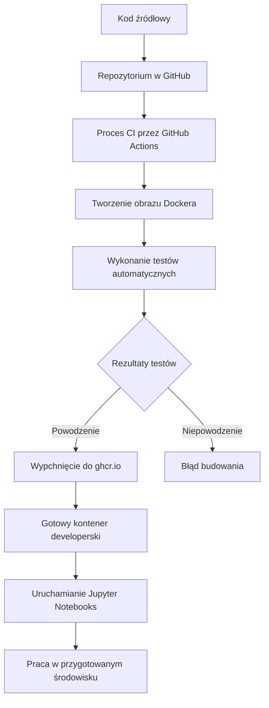

# Raport z projektu
## Sieć Jako Usługa

**Projekt kontenera developerskiego**

---

# Konfiguracja repozytorium

## Wykonane zadania:

- Utworzyłem forka repozytorium bazowego na swoim koncie GitHub.
- Projekt otworzyłem lokalnie w Visual Studio Code.
- Zbudowałem obraz Dockera poleceniem:
`docker build -t sjuprojekt .`
- Uruchomiłem kontener:
`docker run -it --rm -v .:/home/vscode/workspace sjuprojekt bash`
- Sprawdziłem dostęp do plików projektu:
`ls /home/vscode/workspace`
- Następnie połączyłem repozytorium lokalne z GitHubem za pomocą: `git remote add origin`
  
## Komendy git użyte w tym punkcie:

```bash
git init
git remote add origin <adres_repo>
git add .
git commit -m "Initial commit"
git push -u origin main
```

---

# Modyfikacje wykonane w Dockerfile

## Zainsatlowanie pakietów w środowisku Dockera

- W środowisku VS Code skorzystałem z rozszerzenia Dev Containers, które pozwala na konfigurację kontenera bezpośrednio z poziomu edytora.
- Zmodyfikowałem plik `Dockerfile`, aby instalował wszystkie potrzebne pakiety:
  - `qiskit`
  - `matplotlib`
  - `pillow`
  - `pycryptodomex`
  - `cryptography`
  - oraz także: `ipykernel`, `jupyter`
- Instalacja wykonałem za pomocą polecenia:
```dockerfile
RUN pip install --no-cache-dir \
  qiskit \
  matplotlib \
  pillow \
  pycryptodomex \
  cryptography
```

---
# Konfiguracja kontenera deweloperskiego
## Wygląd pliku `.devcontainer/devcontainer.json`
```json
{
  "workspaceMount": "source=${localWorkspaceFolder},target=/home/vscode/workspace,type=bind,consistency=cached",
  "workspaceFolder": "/home/vscode/workspace",
  "name": "Projekt-SJU",
  "image": "ghcr.io/dthrnnr/projekt_sju:latest",
  "customizations": {
    "vscode": {
      "extensions": [
        "ms-python.python",
        "ms-toolsai.jupyter",
        "yzhang.markdown-all-in-one",
        "marp-team.marp-vscode",
        "github.vscode-github-actions"
      ]
    }
  },
  "postCreateCommand": "pip install --no-cache-dir -r requirements.txt && uname -a && python --version && pip --version",
  "remoteUser": "vscode"
}
```
## Zadania wykonane w VSCode
- Utworzyłem plik `.devcontainer/devcontainer.json` i dodałem w nim odpowiednie ustawienia.
- W sekcji `customizations` skonfigurowałem wymagane rozszerzenia dla VS Code.
- Dodałem również polecenie `postCreateCommand`, które automatycznie instaluje zależności po uruchomieniu kontenera.
- Do konfiguracji wykorzystałem gotowy obraz Dockera: `ghcr.io/piotrkwia/projekt_sju:latest`.
- Środowisko uruchomiłem lokalnie w edytorze VS Code jako kontener developerski.
  
Dodane rozszerzenia w VS Code: Markdown All in One, Marp for VS Code, GitHub Actions
---

# GitHub Actions

- W katalogu głównym projektu utworzyłem folder .`github/workflows`.
- Dodałem w nim plik `docker-build.yml`, który definiuje prosty pipeline CI.
- Pipeline został skonfigurowany tak, aby uruchamiał się automatycznie przy każdym `push` oraz `pull_request` do gałęzi `main`.
- W ramach workflow wykonywane są kolejne kroki: ustawienie środowiska (checkout kodu i instalacja Pythona), instalacja zależności z pliku `requirements.txt`, a następnie walidacja składni i poprawności kodu (lint/test).

```yaml
name: Build, Test and Publish Docker Image

on:
  workflow_dispatch:
  release:
    types: [created]

env:
  REGISTRY: ghcr.io
  IMAGE_NAME: piotrkwia/projekt_sju

jobs:
  build:
    runs-on: ubuntu-latest

    steps:
      - name: Checkout repository
        uses: actions/checkout@v3

      - name: Set up Docker Buildx
        uses: docker/setup-buildx-action@v3

      - name: Log into registry ${{ env.REGISTRY }}
        uses: docker/login-action@v3
        with:
          registry: ${{ env.REGISTRY }}
          username: ${{ github.actor }}
          password: ${{ secrets.CR_PAT }}

      - name: Build Docker image
        run: docker build -t ${{ env.REGISTRY }}/${{ env.IMAGE_NAME }}:latest .

      - name: Run test script inside container
        run: |
          docker run --rm ${{ env.REGISTRY }}/${{ env.IMAGE_NAME }}:latest python /home/vscode/workspace/test.py

      - name: Push image to GitHub Container Registry
        run: docker push ${{ env.REGISTRY }}/${{ env.IMAGE_NAME }}:latest
        
```

Testy wykonane w zadaniu:
```python
def test_imports():
    packages = [
        "qiskit",
        "matplotlib",
        "PIL",  # Pillow
        "Cryptodome",  # Pycryptodomex
        "cryptography"
    ]

    for pkg in packages:
        try:
            __import__(pkg)
            print(f"✅ {pkg} - OK")
        except ImportError:
            print(f"❌ {pkg} - MISSING")
            exit(1)

if __name__ == "__main__":
    test_imports()

```

---

# Diagram pracy

<div class="flex justify-center">



</div>

---

# Jupyter Notebooks

## Za pomocą środowiska lokalnego (VSCode)

- Do pracy z notebookami korzystałem z rozszerzenia `Jupyter` dostępnego w edytorze Visual Studio Code.
- Pliki `.ipynb` uruchamiałem i edytowałem lokalnie wewnątrz kontenera developerskiego.
- Środowisko było oparte na wcześniej przygotowanym obrazie Dockera oraz konfiguracji zapisanej w pliku `devcontainer.json`.
- Jako kernel wykorzystywałem wirtualne środowisko .`venv`, co zapewniało dostęp do wszystkich wymaganych zależności.
- Notatniki wykorzystywały bibliotekę `Qiskit` do przesyłania zadań na komputer kwantowy IBM Quantum.
- Dzięki integracji z Jupyter mogłem bezpośrednio wizualizować wyniki oraz prowadzić interaktywną analizę danych.


---

# Wyzwania i doświadczenia

## Najtrudniejsze wyzwania:

- Skonfigurowałem GitHub Actions z odpowiednimi uprawnieniami, aby możliwa była publikacja obrazu Dockera do rejestru.
- Na etapie budowy obrazu rozwiązywałem błędy pojawiające się podczas procesu kompilacji.
- Dbałem również o utrzymanie spójności wersji obrazu pomiędzy lokalnym kontenerem developerskim a obrazem publikowanym w rejestrze kontenerów.

## Wiedza wyciagnięta z zadania:

- W jaki sposób efektywnie wykorzystywać kontenery w środowisku pracy z VSCode i Dockerem
- Jak wdrożyć automatyzację procesów CI/CD z pomocą GitHub Actions
- Jak połączyć różne rozwiązania cloud-native w spójną architekturę projektu

## Co można rozwinąć w zadaniu:

- Warto wzbogacić projekt o dodatkowe przykłady zastosowania zadań kwantowych w praktyce, co pozwoli lepiej zobrazować możliwości technologii i ułatwi zrozumienie jej potencjału.
- Warto wzbogacić projekt o dodatkowe przykłady zastosowania zadań kwantowych w praktyce, co pozwoli lepiej zobrazować możliwości technologii i ułatwi zrozumienie jej potencjału.

---

# Podsumowanie

## Zrealizowane elementy:

- Konteneryzacja środowiska programistycznego
- Automatyzacja CI/CD z GitHub Actions 
- Publikacja obrazów do GitHub Container Registry  
- Integracja Jupyter Notebooków w kontenerze 
